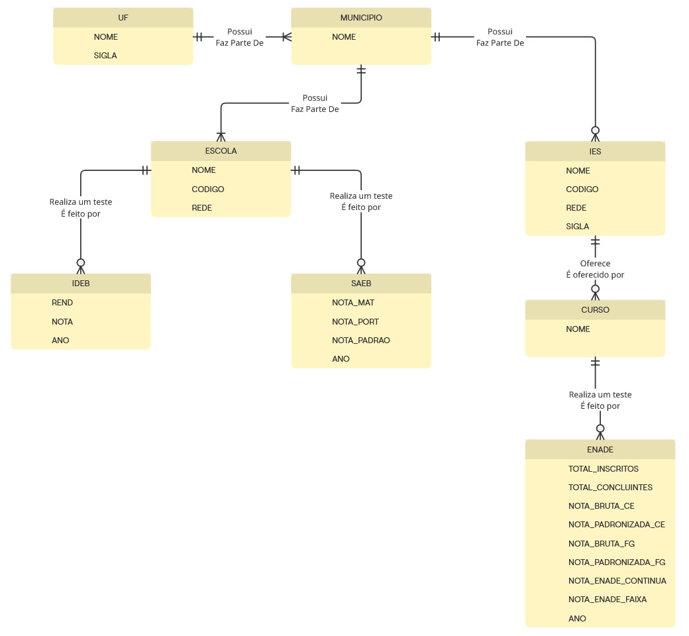

# Projeto de Integração de Dados Educacionais

Este projeto integra dados do ENADE, IDEB e SAEB em um banco de dados relacional PostgreSQL, permitindo análises sobre a qualidade da educação brasileira em diferentes níveis de ensino.

### Passos para executar o projeto:

#### 1: Crie um banco de dados
Certifique-se de que você tem um banco de dados PostgreSQL disponível. Crie um banco de dados e defina as propriedades:
- database_name
- user
- password
- host
- port

Dentro de prog.py você deve alterar a conexão do psycopg2 que é definida logo após a execução da main do programa:

```python
    conn = psycopg2.connect(
        dbname="<database_name>",
        user="<user>",
        password="<password>",
        host="<host>",
        port="<port>"
    )
```

Além disso, você deve alterar a string de conexão logo acima da função main do programa
```python
connection_string = "postgresql://<user>:<password>@<host>:<port>/<database_name>"
```

#### 2: Execute o programa
```
python3 prog.py
```

Haverá o tempo de execução de população das tabelas. Após a execução é recomendável que você altere o valor da variável 'criar_tabelas', pois isso evitará o processo de criação e tornará o tempo de execução bem mais rápido.

Após o final da execução teremos os resultados gravados em:

**media_enade_up_ano.txt**
**top5_notas_saeb_2023.txt**
**notas_da_unicamp_enade.txt**
**media_saeb_municipio.txt**
**numero_escolas_rede_uf.txt**
**melhores_escolas_comp.txt**

## O programa irá:

1. **Criar as tabelas necessárias**
2. **Importar os dados dos arquivos CSV na pasta data**
3. **Processar e relacionar as informações**
4. **Calcular estatísticas básicas por município**

## Entidades em questão:

* **UF: unidades federativas**
* **Município: municípios brasileiros**
* **IES: instituições de ensino superior**
* **Curso: cursos superiores**
* **Escola: escolas de ensino básico**
* **ENADE: resultados do Exame Nacional de Desempenho de Estudantes**
* **IDEB: resultados do Índice de Desenvolvimento da Educação Básica**
* **SAEB: resultados do Sistema de Avaliação da Educação Básica**
* **Ano: relaciona as entidades com seus respectivos anos de avaliação**

## Detalhes:

### Modelo Conceitual:
<p align="center">
    
</p>

### Modelo Físico:
Modelo físico projetado pelo Grupo:
<p align="center">
    
</p>

Modelo físico fornecido pelo PG-Admin:
<p align="center">
    
</p>

## Requisitos

* **Python 3.6+**
* **PostgreSQL**
* **Bibliotecas Python: pandas, sqlalchemy, psycopg2**
